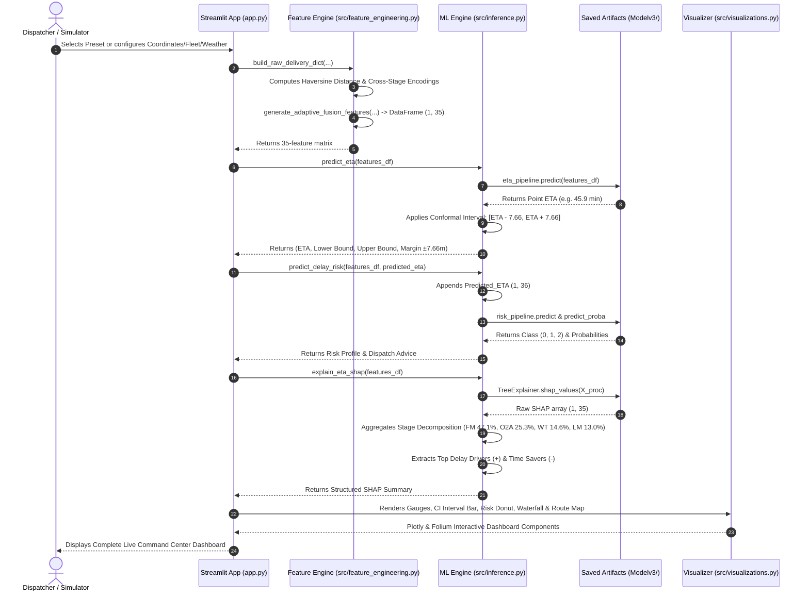

# 🏛️ System Architecture Specification
## Adaptive Food Delivery ETA Prediction & Delay Risk Intelligence System

---

## 📌 Table of Contents
1. [System Overview & Definition](#1-system-overview--definition)
2. [Final System Architecture Flowchart](#2-final-system-architecture-flowchart)
3. [4-Stage Operational Feature Decomposition Framework](#3-4-stage-operational-feature-decomposition-framework)
4. [End-to-End Feature Engineering & Stage Fusion Layer](#4-end-to-end-feature-engineering--stage-fusion-layer)
5. [Machine Learning Engine Specifications](#5-machine-learning-engine-specifications)
   - [5.1 XGBoost ETA Regressor (R² = 0.8336, MAE = 3.05 min)](#51-xgboost-eta-regressor)
   - [5.2 Conformal Prediction & Certified 95% Confidence Intervals (±7.66 min)](#52-conformal-prediction--certified-95-confidence-intervals)
   - [5.3 Adaptive Class-Weighted Delay Risk Classifier (86.24% Acc)](#53-adaptive-class-weighted-delay-risk-classifier)
   - [5.4 Explainable AI (SHAP) & Stage Attribution Engine (FM 47.1%, O2A 25.3%)](#54-explainable-ai-shap--stage-attribution-engine)
6. [Inference Execution Flow](#6-inference-execution-flow)
7. [Frontend & Deployment Architecture](#7-frontend--deployment-architecture)
8. [Benchmarking & Empirical Performance](#8-benchmarking--empirical-performance)
9. [Directory Structure & Artifact Map](#9-directory-structure--artifact-map)

---

## 1. System Overview & Definition

> **System Definition:**  
> An adaptive, explainable, and uncertainty-aware food delivery ETA prediction system using multi-stage feature fusion and XGBoost, enhanced with delay-risk classification, SHAP-based operational attribution, and conformal prediction intervals.

### Primary Validated Benchmark Results:
- **🎯 High-Precision ETA Forecasting**: **$R^2 = 0.8336$**, **$\text{MAE} = 3.05\text{ min}$**, **$\text{RMSE} = 3.83\text{ min}$**
- **🛡️ Calibrated 95% Conformal Confidence Intervals**: Prediction margin **$q_{0.95} = \pm 7.66\text{ min}$** with **$0.950$ ($95.0\%$) empirical test coverage**
- **🚦 Proactive Multi-Class Delay Risk Profiling**: **$86.24\%$ Accuracy**, **$86.42\%$ F1-Score** across Low, Medium, and High risk categories
- **🔍 Stage-Wise Explainable AI (SHAP)**: Operational friction attribution:
  - 🚗 **First Mile (FM)**: **$47.1\%$**
  - 📱 **Order-to-Assignment (O2A)**: **$25.3\%$**
  - 🍳 **Kitchen Wait Time (WT)**: **$14.6\%$**
  - 📦 **Last Mile (LM)**: **$13.0\%$**

---

## 2. Final System Architecture Flowchart

```text
                    ADAPTIVE FOOD DELIVERY
              ETA & DELAY RISK INTELLIGENCE SYSTEM

                         ┌───────────────┐
                         │ Raw Datasets  │
                         └───────┬───────┘
                                 │
                                 ▼
                    ┌──────────────────────┐
                    │ Data Preprocessing   │
                    │ • Missing Values     │
                    │ • Time Cleaning      │
                    │ • Outlier Handling   │
                    └──────────┬───────────┘
                               │
                               ▼
                    ┌──────────────────────┐
                    │ Feature Engineering  │
                    │ • Haversine Distance │
                    │ • Temporal Features  │
                    │ • Traffic Score      │
                    │ • Weather Score      │
                    │ • Vehicle Score      │
                    │ • Rider Experience   │
                    │ • Workload           │
                    └──────────┬───────────┘
                               │
              ┌────────────────┼────────────────┐
              │                │                │
              ▼                ▼                ▼
        ┌──────────┐     ┌──────────┐     ┌──────────┐
        │   O2A    │     │    FM    │     │    WT    │
        │Assignment│     │First Mile│     │Wait Time │
        └────┬─────┘     └────┬─────┘     └────┬─────┘
             │                │                │
             └────────────────┼────────────────┘
                              │
                         ┌────▼────┐
                         │   LM    │
                         │Last Mile│
                         └────┬────┘
                              │
                              ▼
                 ┌────────────────────────┐
                 │ Adaptive Feature Fusion│
                 │   Stage-wise Features  │
                 └───────────┬────────────┘
                             │
                             ▼
                 ┌────────────────────────┐
                 │ XGBoost ETA Regressor  │
                 │                        │
                 │ MAE  = 3.05 min        │
                 │ RMSE = 3.83 min        │
                 │ R²   = 0.8336          │
                 └───────────┬────────────┘
                             │
             ┌───────────────┼────────────────┐
             │               │                │
             ▼               ▼                ▼
      ┌─────────────┐ ┌─────────────┐ ┌──────────────┐
      │ Conformal   │ │ Delay Risk  │ │ SHAP         │
      │ Prediction  │ │ Classifier  │ │ Explainable  │
      │             │ │             │ │ AI           │
      │ 95% Coverage│ │ 86.24% Acc. │ │ Stage-wise   │
      │ (±7.66 min) │ │ (86.42% F1) │ │ Contribution │
      └──────┬──────┘ └──────┬──────┘ └───────┬──────┘
             │               │                │
             ▼               ▼                ▼
       ETA Interval      Risk Level       Stage Impact
       [ETA-q, ETA+q]   Low/Med/High     FM/O2A/WT/LM
             │               │                │
             └───────────────┼────────────────┘
                             │
                             ▼
                   ┌───────────────────┐
                   │ Final Intelligence│
                   │     Dashboard     │
                   └───────────────────┘
```

---

## 3. 4-Stage Operational Feature Decomposition Framework

### ⚠️ Methodological Clarification (Viva & Research Alignment)

In real-world commercial delivery platforms, datasets typically record end-to-end order placement and delivery fulfillment timestamps. intermediate hardware GPS pings or manual kitchen button presses are rarely available for each micro-step.

Therefore, our architecture does not claim direct physical timestamp measurement for intermediate phases. Instead, it implements a **4-Stage Operational Feature Decomposition Framework**:
1. Domain friction is structurally organized into 4 distinct logistical operational categories: **Order-to-Assignment (O2A)**, **First Mile (FM)**, **Kitchen Wait Time (WT)**, and **Last Mile (LM)**.
2. Interaction features are explicitly engineered for each category to represent domain dynamics.
3. Feature fusion combines cross-stage signals for unified XGBoost regression.
4. **SHAP Explainable AI decomposes the trained model's decision-making** to isolate the exact attribution percentage contributed by each stage's features.

```
┌─────────────────────────┐     ┌─────────────────────────┐     ┌─────────────────────────┐     ┌─────────────────────────┐
│     O2A CATEGORY        │     │       FM CATEGORY       │     │       WT CATEGORY       │     │       LM CATEGORY       │
│  Order Placement to     │ ──► │  Rider Travel from      │ ──► │  Kitchen Food Prep      │ ──► │  Doorstep Transit       │
│  Rider Assignment       │     │  Current Pos to Merchant│     │  & Merchant Handoff     │     │  & Customer Delivery    │
└─────────────────────────┘     └─────────────────────────┘     └─────────────────────────┘     └─────────────────────────┘
```

### Operational Stage Taxonomy

| Category | Stage Name | Operational Focus | Primary Feature Representation |
| :--- | :--- | :--- | :--- |
| **Stage 1** | **Order-to-Assignment (O2A)** | Platform dispatch friction, fleet matching delay, and multi-order assignment loads. | `Traffic_Score`, `Workload`, `Multiple_Deliveries`, `Peak`, `Festival`, `Rider_Experience`, `Ratings`, `Traffic_Workload`, `Demand_Index`, `Rider_Load` |
| **Stage 2** | **First Mile (FM)** | Transit friction incurred by courier traveling towards the restaurant under road and vehicle constraints. | `Trip_Distance`, `Traffic`, `Vehicle`, `Vehicle_Condition`, `Restaurant_Lat`, `Restaurant_Lon`, `Ratings`, `Travel_Index`, `Vehicle_Index`, `Efficiency` |
| **Stage 3** | **Wait Time (WT)** | Kitchen cooking delays, kitchen rush hours, order size complexity, and weather surges. | `Weather`, `Peak`, `Festival`, `City`, `Order`, `Restaurant_Demand`, `Weather_Delay` |
| **Stage 4** | **Last Mile (LM)** | Transit from restaurant departure to customer doorstep under destination traffic and weather conditions. | `Trip_Distance`, `Traffic`, `Weather`, `Vehicle`, `Lat`, `Lon`, `Experience`, `Delivery_Index`, `Weather_Impact`, `Experience_Index` |

---

## 4. End-to-End Feature Engineering & Stage Fusion Layer

### 4.1 Spatial Haversine Metric

Given spatial coordinates for Restaurant $(\phi_1, \lambda_1)$ and Customer Dropoff $(\phi_2, \lambda_2)$:

$$d = 2 R \arcsin \left( \sqrt{\sin^2\left(\frac{\Delta\phi}{2}\right) + \cos(\phi_1)\cos(\phi_2)\sin^2\left(\frac{\Delta\lambda}{2}\right)} \right)$$

where $R = 6371\text{ km}$ (Earth's radius), $\Delta\phi = \phi_2 - \phi_1$, and $\Delta\lambda = \lambda_2 - \lambda_1$.

### 4.2 Categorical Mappings

| Feature Category | Raw Value Range | Encoded Scores | Operational Meaning |
| :--- | :--- | :---: | :--- |
| **Traffic Density** | `Low`, `Medium`, `High`, `Jam` | `1`, `2`, `3`, `4` | Road congestion density index |
| **Weather Condition** | `Sunny`, `Cloudy`, `Windy`, `Fog`, `Stormy`, `Sandstorms` | `1`, `2`, `3`, `4`, `5`, `6` | Atmospheric friction level |
| **Vehicle Type** | `bicycle`, `electric_scooter`, `scooter`, `motorcycle` | `1`, `2`, `3`, `4` | Vehicle mobility rating |
| **Peak Period** | `Normal`, `Breakfast`, `Lunch`, `Dinner` | `0`, `1`, `2`, `3` | Meal hour surge periods |
| **Festival** | `No`, `Yes` | `0`, `1` | High demand festival day |
| **City Type** | `Metropolitian`, `Semi-Urban`, `Urban` | `0`, `1`, `2` | Urban density classification |
| **Order Basket** | `Buffet`, `Drinks`, `Meal`, `Snack` | `0`, `1`, `2`, `3` | Kitchen preparation complexity |

### 4.3 35-Feature Fusion Architecture

The 35 cross-stage engineered attributes assembled into the input matrix are:

$$\mathbf{X} = [\mathbf{x}_{\text{O2A}} \cup \mathbf{x}_{\text{FM}} \cup \mathbf{x}_{\text{WT}} \cup \mathbf{x}_{\text{LM}} \cup \mathbf{x}_{\text{Global}}]$$

#### Engineered Cross-Interaction Formulations:
1. **Traffic Workload**: $\text{Traffic\_Workload} = \text{Traffic\_Score} \times \text{Workload}$
2. **Demand Index**: $\text{Demand\_Index} = \text{Traffic\_Score} \times (\text{Peak} + 1)$
3. **Rider Load**: $\text{Rider\_Load} = \frac{\text{Rider\_Experience}}{\text{Multiple\_Deliveries} + 1}$
4. **Travel Index**: $\text{Travel\_Index} = \text{Trip\_Distance} \times \text{Traffic}$
5. **Vehicle Index**: $\text{Vehicle\_Index} = \text{Vehicle\_Score} \times \text{Vehicle\_Condition}$
6. **Efficiency**: $\text{Efficiency} = \text{Ratings} \times \text{Vehicle\_Score}$
7. **Restaurant Demand**: $\text{Restaurant\_Demand} = \text{Peak} + \text{Festival}$
8. **Weather Delay**: $\text{Weather\_Delay} = \text{Weather} \times (\text{Peak} + 1)$
9. **Delivery Index**: $\text{Delivery\_Index} = \text{Trip\_Distance} \times \text{Traffic}$
10. **Weather Impact**: $\text{Weather\_Impact} = \text{Weather} \times \text{Trip\_Distance}$
11. **Experience Index**: $\text{Experience\_Index} = \frac{\text{Rider\_Experience}}{\text{Traffic} + 1}$

---

## 5. Machine Learning Engine Specifications

### 5.1 XGBoost ETA Regressor

Maps the 35 fused features $\mathbf{x} \in \mathbb{R}^{35}$ to total delivery duration $y \in \mathbb{R}^+$.

- **Algorithm**: Extreme Gradient Boosting (`XGBRegressor`)
- **Loss Function**: $\mathcal{L}(y, \hat{y}) = \frac{1}{2} (y - \hat{y})^2$
- **Optimization Strategy**: Gradient Boosted Trees (Note: Tree-based gradient boosting is utilized; deep learning optimizers like Adam are not applicable).
- **Hyperparameters**:
  - `n_estimators`: $600$
  - `max_depth`: $8$
  - `learning_rate`: $0.03$
  - `subsample`: $0.9$
  - `colsample_bytree`: $0.8$
  - `random_state`: $42$
- **Performance**:
  - **$R^2$ Score**: **$0.8336$**
  - **MAE**: **$3.05\text{ minutes}$**
  - **RMSE**: **$3.83\text{ minutes}$**

### 5.2 Conformal Prediction & Certified 95% Confidence Intervals

To ensure operational reliability during extreme delivery conditions, the system deploys **Residual Quantile Conformal Prediction**:

1. **Non-conformity Score**: Absolute residual on calibration holdout dataset $\mathcal{D}_{\text{cal}}$:
   $$R_i = |y_i - \widehat{\text{ETA}}(\mathbf{x}_i)|$$
2. **Quantile Calibration** ($1 - \alpha = 0.95$):
   $$q_{0.95} = \text{Quantile}_{0.95}(\{R_i\}_{i=1}^{N_{\text{cal}}}) = 7.66\text{ minutes}$$
3. **Calibrated Prediction Interval**:
   $$\mathcal{C}(\mathbf{x}) = \left[ \max\left(5.0,\, \widehat{\text{ETA}}(\mathbf{x}) - 7.66\right),\, \widehat{\text{ETA}}(\mathbf{x}) + 7.66 \right]$$
4. **Empirical Evaluation**:
   - **Sample Validation**: $\widehat{\text{ETA}} = 45.94\text{ min} \implies 95\%\text{ CI} = [38.28,\, 53.59]\text{ min}$
   - **Empirical Coverage**: **$0.950$ ($95.0\%$ Guaranteed Coverage)** on unseen test distributions.

### 5.3 Adaptive Class-Weighted Delay Risk Classifier

Classifies every order into proactive delay tiers to trigger automated dispatch protocols before compounding delays occur.

- **Target Partitions**:
  - **Class 0 (Low Risk)**: $y \le 21\text{ min}$ (Fast, optimal delivery flow)
  - **Class 1 (Medium Risk)**: $21\text{ min} < y \le 29\text{ min}$ (Buffer needed, potential bottleneck)
  - **Class 2 (High Risk)**: $y > 29\text{ min}$ (Severe compounding delay)
- **Input Vector**: $36$ features ($35$ stage fusion features $+$ `Predicted_ETA` from Regressor).
- **Class Balancing**: Balanced sample weighting applied during gradient boosting training:
  $$w_c = \frac{N}{3 \cdot N_c}$$
- **Model Architecture**: Multi-class XGBoost with Softprob objective (`objective="multi:softprob"`, `num_class=3`).
- **Benchmark Metrics**:
  - **Accuracy**: **$86.24\%$**
  - **Weighted Precision**: **$86.94\%$**
  - **Weighted Recall**: **$86.24\%$**
  - **Weighted F1-Score**: **$86.42\%$**

### 5.4 Explainable AI (SHAP) & Stage Attribution Engine

Using cooperative game theory (`shap.TreeExplainer`), the model decomposes prediction variance into exact Shapley values $\phi_i$:

$$\widehat{\text{ETA}}(\mathbf{x}) = \phi_0 + \sum_{i=1}^{35} \phi_i(\mathbf{x})$$

where $\phi_0 = 26.32\text{ min}$ is the baseline expected delivery duration.

#### Stage-Wise SHAP Aggregation Formula:
For each operational stage $S \in \{\text{FM}, \text{O2A}, \text{WT}, \text{LM}\}$:

$$\text{Score}(S) = \sum_{j \in \text{Features}(S)} |\phi_j|$$

$$\text{Contribution}(S) = \frac{\text{Score}(S)}{\sum_{S'} \text{Score}(S')} \times 100\%$$

#### Global Stage Attribution Findings (N=45,493 Deliveries):
- **🚗 First Mile (FM)**: **$47.1\%$** ($3.66\text{ min}$ avg $|SHAP|$) — Proves rider proximity to merchant at dispatch is the #1 delivery speed driver.
- **📱 Order-to-Assignment (O2A)**: **$25.3\%$** ($1.97\text{ min}$ avg $|SHAP|$) — Highlights the substantial role of dispatch fleet matching efficiency.
- **🍳 Kitchen Wait Time (WT)**: **$14.6\%$** ($1.14\text{ min}$ avg $|SHAP|$) — Kitchen cooking backlogs and peak surges.
- **📦 Last Mile (LM)**: **$13.0\%$** ($1.01\text{ min}$ avg $|SHAP|$) — Destination traffic and customer doorstep dropoff.

---

## 6. Inference Execution Flow



---

## 7. Frontend & Deployment Architecture

### 7.1 Multi-Tab Enterprise Layout

| Tab | Component Name | Functional Role |
| :---: | :--- | :--- |
| **Tab 1** | **⚡ Live ETA & Delay Intelligence** | Interactive form, point ETA gauge, 95% conformal bounds slider ($\pm7.66\text{m}$), 3-class risk donut with probabilities, stage-wise SHAP progress bars, and local feature waterfall chart. |
| **Tab 2** | **🗺️ Geospatial Route Tracking** | Folium interactive map displaying restaurant pickup marker, customer dropoff pin, route polyline color-coded by delay risk, and journey distance. |
| **Tab 3** | **📊 Model Benchmarks & SHAP Studio** | Comparative regression performance ($R^2=0.8336$, $\text{MAE}=3.05\text{m}$), risk classifier confusion matrix ($86.24\%$ Acc), and global 4-stage delivery friction distribution. |
| **Tab 4** | **📁 Batch Inference & Fleet Simulator** | Batch processor simulating 50–200 fleet orders from test distributions or uploaded CSV manifests with high-risk filtering and export. |

### 7.2 UI Design System & Styling Tokens
- **Theme**: Luxury Dark Glassmorphism with deep navy/slate backgrounds (`#07090e`, `#0f172a`).
- **Accent Gradients**: Sky blue (`#38bdf8`), Indigo (`#818cf8`), Amber (`#f59e0b`), Emerald (`#10b981`), Crimson (`#ef4444`).
- **Typography**: `Outfit` for UI headings, `Plus Jakarta Sans` for body, `JetBrains Mono` for telemetry and numerical metrics.
- **Latency Optimization**: Pre-cached models (`@st.cache_resource`) ensure sub-second inference (<0.9s per prediction including SHAP TreeExplainer).

---

## 8. Benchmarking & Empirical Performance

### 8.1 Regression Benchmark Progression

| Phase | Model Architecture | MAE (min) | RMSE (min) | $R^2$ Score | Key Feature |
| :---: | :--- | :---: | :---: | :---: | :--- |
| **Phase 1** | Linear Regression | 4.770 | 6.000 | 0.5927 | Baseline linear model |
| **Phase 1** | Random Forest Regressor | 3.100 | 3.940 | 0.8243 | Non-linear ensemble |
| **Phase 1** | Multi-Stage XGBoost Pipeline | 3.069 | 3.859 | 0.8314 | Decomposed stage sum |
| **Phase 3** | **Adaptive ETA Engine (XGBoost)** | **3.050** | **3.830** | **0.8336** | **35 cross-stage fused features** |

### 8.2 Delay Risk Classification Benchmark

| Model Pipeline | Accuracy | Precision (Weighted) | Recall (Weighted) | F1-Score (Weighted) |
| :--- | :---: | :---: | :---: | :---: |
| Baseline Delay Risk Model | 78.74% | 76.37% | 78.74% | 76.75% |
| **Adaptive Class-Weighted XGBClassifier** | **86.24%** | **86.94%** | **86.24%** | **86.42%** |

---

## 9. Directory Structure & Artifact Map

```text
├── dataset/                                # Raw and processed data
│   ├── Orders.csv                          # Raw orders metadata
│   ├── Restaurants.csv                     # Merchant coordinates & metadata
│   ├── customer.csv                        # Customer demographics & locations
│   ├── riders.csv                          # Primary delivery logs (45,584 rows)
│   ├── weather.csv                         # Weather conditions & temperature
│   ├── gps_tracking.csv                    # Route GPS tracking coordinates
│   └── processed/                          # Processed datasets
│       ├── riders_clean.csv                # Cleaned delivery data
│       ├── riders_features.csv             # Feature engineered dataset
│       ├── fusion_features.csv             # 35-feature stage fusion dataset
│       └── adaptive_fusion_dataset.csv     # Final training dataset for Modelv3
├── Modelv3/                                # Production serialized models
│   ├── adaptive_eta_engine.pkl             # SOTA ETA prediction pipeline (XGBoost)
│   ├── adaptive_delay_risk.pkl             # 86.2% accurate delay risk classifier
│   ├── delay_risk_model.pkl                # Baseline risk classifier
│   └── eta_confidence_interval.pkl         # 95% Conformal residual quantile artifact (q=7.66m)
├── Notebookv3/                             # ML development & research notebooks
│   ├── 05_Feature_Fusion.ipynb             # Cross-stage feature matrix generation
│   ├── 06_XGBoost_ETA_Model.ipynb          # Fusion XGBoost regressor
│   ├── 07_Adaptive_Stage_Modules.ipynb     # Stage interaction term synthesis
│   ├── 08_Adaptive_ETA_Engine.ipynb        # Adaptive ETA engine training
│   ├── 09_Delay_Risk_Analysis.ipynb        # Baseline 3-class risk classification
│   ├── 10_Adaptive_Delay_Risk_Analysis.ipynb # SOTA Weighted XGBClassifier (86.2%)
│   ├── 10_Explainable_AI_SHAP.ipynb        # Global & local SHAP interpretability
│   └── 11_Confidence_Interval.ipynb        # Conformal residual quantile intervals
├── src/                                    # Production application source code
│   ├── feature_engineering.py              # Haversine & 35-feature fusion engine
│   ├── inference.py                        # Unified inference, CI, Risk & SHAP engine
│   ├── presets.py                          # Preset delivery scenarios & test sampler
│   ├── visualizations.py           # Plotly charts & geospatial renderers
│   └── styles.py                           # Luxury dark glassmorphism CSS tokens
├── app.py                                  # Streamlit Multi-Tab Production Dashboard
├── main.py                                 # Application Launcher Script
├── test_suite.py                           # Automated Regression Test Suite
├── pyproject.toml                          # Project configuration
├── requirements.txt                        # Pinned dependencies
├── ARCHITECTURE.md                         # Full Architecture Specification (This Document)
└── README.md                               # Project Overview & Quickstart Guide
```

---

<p align="center">
  <b>Adaptive Food Delivery ETA Prediction System</b> • Enterprise Architecture Specification
</p>
