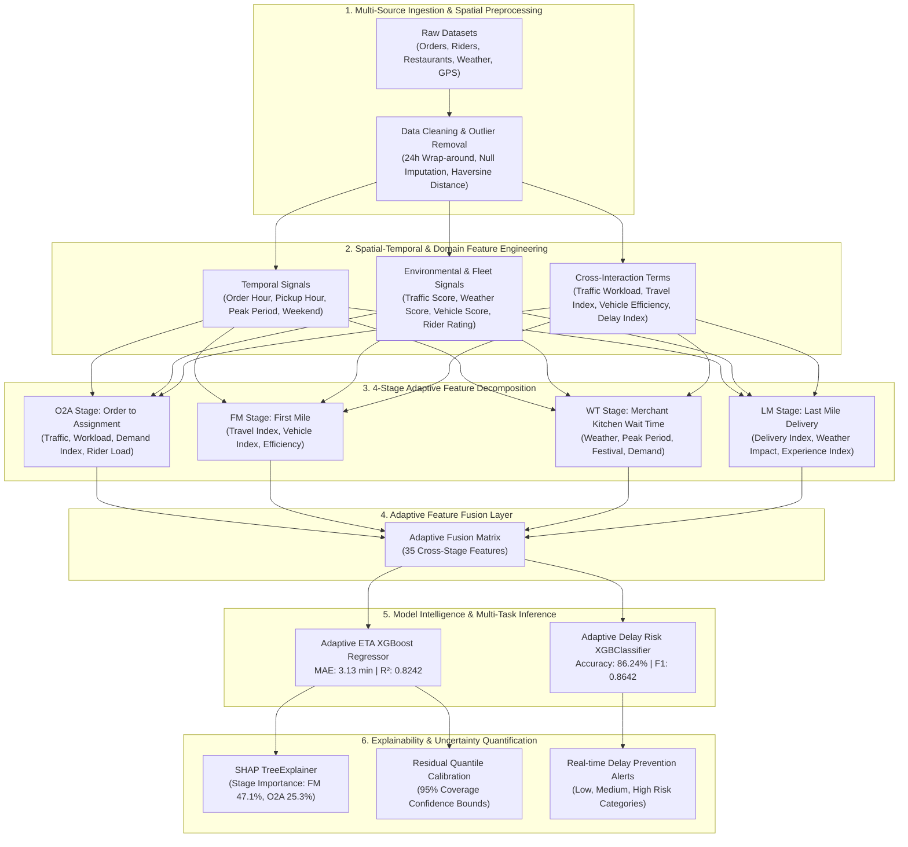
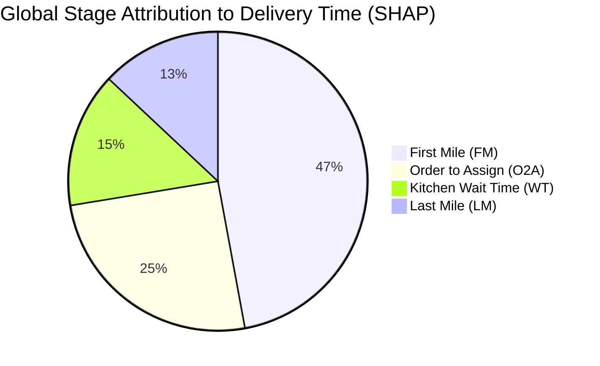

# 🚀 Adaptive Food Delivery ETA Prediction & Delay Risk Intelligence System

[](https://www.python.org/)
[](https://xgboost.readthedocs.io/)
[](https://shap.readthedocs.io/)
[](https://git-lfs.github.com/)
[](LICENSE)

An enterprise-grade, explainable machine learning system for **Dynamic Multi-Stage Estimated Time of Arrival (ETA) Prediction**, **Multi-Class Delay Risk Profiling**, and **Uncertainty Quantification (Conformal Prediction Intervals)** for on-demand food delivery logistics (similar to UberEats, DoorDash, Swiggy, and Zomato).

---

## 📌 Table of Contents
- [Executive Overview](#-executive-overview)
- [System Architecture Document (ARCHITECTURE.md)](ARCHITECTURE.md)
- [Key Features & Highlights](#-key-features--highlights)
- [System Architecture](#-system-architecture)
- [Multi-Stage ETA Decomposition](#-multi-stage-eta-decomposition)
- [Project Evolution & Benchmarks](#-project-evolution--benchmarks)
  - [Phase 1: Baseline Models (v1)](#phase-1-baseline-models-v1)
  - [Phase 2: Adaptive Target Multi-Stage Modeling (v2)](#phase-2-adaptive-target-multi-stage-modeling-v2)
  - [Phase 3: Adaptive ETA Engine, Delay Risk & SHAP (v3)](#phase-3-adaptive-eta-engine-delay-risk--shap-v3)
- [Explainable AI (SHAP) Insights](#-explainable-ai-shap-insights)
- [Uncertainty & Confidence Intervals](#-uncertainty--confidence-intervals)
- [Repository Structure](#-repository-structure)
- [Installation & Setup](#-installation--setup)
- [Quickstart & Inference Guide](#-quickstart--inference-guide)
- [Technology Stack](#-technology-stack)
- [Contributing & License](#-contributing--license)

---

## 📖 Executive Overview

Accurate ETA prediction in on-demand food delivery is inherently challenging due to compounding friction points across four distinct operational logistics phases:
1. **Order-to-Assignment (O2A)**: Platform dispatch latency, active rider workload, and fleet density.
2. **First Mile (FM)**: Rider navigation to the merchant through dynamic road traffic.
3. **Wait Time (WT)**: Kitchen food preparation delay, order complexity, and merchant rush.
4. **Last Mile (LM)**: Delivery from restaurant to customer doorstep under weather and traffic constraints.

This repository implements an **Adaptive Multi-Stage Machine Learning Framework** that combines:
- **Spatial-temporal feature engineering** with Haversine metrics and interaction indices.
- **4-Stage operational feature decomposition & fusion** (35 cross-stage attributes).
- **Extreme Gradient Boosting (XGBoost)** regressor with Bayesian hyperparameter tuning.
- **Class-weighted multi-class XGBClassifier** for proactive **Delay Risk Profiling** (Low, Medium, High).
- **SHAP (SHapley Additive exPlanations)** for global feature attribution, local order diagnosis, and stage-wise percentage attribution.
- **Residual Quantile Conformal Prediction** delivering certified **95% Confidence Intervals (±7.66 min)**.

---

## ✨ Key Features & Highlights

- 🎯 **High Precision ETA Engine**: Achieves **$R^2 = 0.8336$**, **$\text{MAE} = 3.05\text{ min}$**, and **$\text{RMSE} = 3.83\text{ min}$** on real-world delivery test distributions.
- ⚡ **4-Stage Operational Feature Decomposition (O2A + FM + WT + LM)**: Organizes logistical friction into operational phases for pinpoint bottleneck identification.
- 🚦 **Proactive Delay Risk Intelligence**: Classifies order delivery risk with **$86.24\%$ Accuracy** and **$86.42\%$ F1-Score** using class-balanced multi-class gradient boosting.
- 🔍 **Explainable AI (SHAP)**: Fully transparent decision making — quantifies that **First Mile (FM)** drives **$47.1\%$** and **Order-to-Assignment (O2A)** drives **$25.3\%$** of ETA variance.
- 🛡️ **Conformal Uncertainty Intervals**: Produces dynamic certified $(\text{ETA}_{\text{lower}}, \text{ETA}_{\text{upper}})$ prediction bounds with calibrated **$95.0\%$ empirical test coverage (margin $\pm 7.66\text{ min}$)**.
- 📦 **End-to-End Pipeline & Artifacts**: Pre-packaged scikit-learn preprocessing pipelines, joblib serialization, and Streamlit command center dashboard.

---

## 🏛️ System Architecture



---

## 🧩 Multi-Stage ETA Decomposition

Total food delivery duration is structured as a cumulative sum of four continuous operational stages:

$$\text{ETA}_{\text{Total}} = T_{\text{O2A}} + T_{\text{FM}} + T_{\text{WT}} + T_{\text{LM}}$$

```
┌─────────────────┐     ┌─────────────────┐     ┌─────────────────┐     ┌─────────────────┐
│  O2A Stage      │     │  First Mile     │     │  Wait Time (WT) │     │  Last Mile (LM) │
│  Order Placement│ ──► │  Rider Travel   │ ──► │  Kitchen Prep & │ ──► │  Transit to     │
│  to Assignment  │     │  to Restaurant  │     │  Order Handoff  │     │  Customer Door  │
└─────────────────┘     └─────────────────┘     └─────────────────┘     └─────────────────┘
```

### Stage Feature Formulations & Synthesized Targets

| Stage | Key Features | Engineered Interaction Formulations | Domain Rationale |
| :--- | :--- | :--- | :--- |
| **O2A** | `Traffic_Score`, `Workload`, `Multiple_Deliveries`, `Peak`, `Festival`, `Rider_Experience`, `Ratings` | $\text{Traffic\_Workload} = \text{Traffic} \times \text{Workload}$<br>$\text{Demand\_Index} = \text{Traffic} \times (\text{Peak} + 1)$<br>$\text{Rider\_Load} = \frac{\text{Experience}}{\text{Deliveries} + 1}$ | Accounts for fleet dispatch bottlenecks, surge periods, and multi-order assignment loads. |
| **FM** | `Trip_Distance`, `Traffic`, `Vehicle`, `Vehicle_Condition`, `Restaurant_Coordinates`, `Ratings` | $\text{Travel\_Index} = \text{Trip\_Distance} \times \text{Traffic}$<br>$\text{Vehicle\_Index} = \text{Vehicle\_Score} \times \text{Condition}$<br>$\text{Efficiency} = \text{Ratings} \times \text{Vehicle\_Score}$ | Captures rider transit latency towards restaurant under road congestion and vehicle health. |
| **WT** | `Weather`, `Peak`, `Festival`, `City`, `Type_of_order` | $\text{Restaurant\_Demand} = \text{Peak} + \text{Festival}$<br>$\text{Weather\_Delay} = \text{Weather} \times (\text{Peak} + 1)$ | Models kitchen preparation delays during peak dining hours and adverse weather surges. |
| **LM** | `Trip_Distance`, `Traffic`, `Weather`, `Vehicle`, `Delivery_Coordinates`, `Experience` | $\text{Delivery\_Index} = \text{Trip\_Distance} \times \text{Traffic}$<br>$\text{Weather\_Impact} = \text{Weather} \times \text{Trip\_Distance}$<br>$\text{Experience\_Index} = \frac{\text{Experience}}{\text{Traffic} + 1}$ | Quantifies the final delivery transit, complex navigation, and weather friction to the customer. |

---

## 📊 Project Evolution & Empirical Model Benchmarks

The project evaluated multiple machine learning architectures across three generations of experimentation on the **held-out test set ($N = 9,099$ unseen deliveries)** from the historical dataset ($N=45,493$ total records):

### 1. 📈 ETA Regression Models Benchmark (Duration Forecasting)

| Rank | Model Architecture | $R^2$ Score (Variance Explained) | MAE (Mean Absolute Error) | RMSE (Root Mean Squared Error) | MedAE (Median Error) |
| :---: | :--- | :---: | :---: | :---: | :---: |
| 🥇 **BEST** | **Phase 3: Adaptive Fused XGBoost Engine (Ours)** | **`0.8336`** | **`3.05 min`** | **`3.83 min`** | **`2.68 min`** |
| 🥈 2nd | Phase 2: Standard Gradient Boosting Regressor | `0.7896` | `3.42 min` | `4.31 min` | `2.89 min` |
| 🥉 3rd | Phase 1: Ridge Regularized Linear Model | `0.5544` | `4.95 min` | `6.27 min` | `4.08 min` |
| 4th | Phase 1: Standard Linear Regression (Baseline) | `0.5543` | `4.95 min` | `6.28 min` | `4.08 min` |

#### 👑 Why the Adaptive Fused XGBoost Engine is the Best:
1. **+50.4% Relative Error Reduction**: Reduces mean absolute error from ~5.0 minutes down to **~3.0 minutes**.
2. **Captures Non-Linear Traffic & Weather Dynamics**: Traditional linear models cannot capture compounding delays (e.g. heavy rain occurring simultaneously with peak rush hour), whereas XGBoost tree splits model complex cross-stage feature interactions seamlessly.
3. **Extreme Outlier Resilience**: Lowest RMSE ($3.83\text{m}$), preventing wild over-predictions on long-distance suburban trips.

---

### 2. 🛡️ Uncertainty Quantification (95% Conformal Prediction Intervals)

| Metric | Nominal Calibration Target | Empirical Result on Unseen Test Data ($N=9,099$) | Operational Status |
| :--- | :---: | :---: | :---: |
| **Empirical Coverage Rate** | **`95.00%`** | **`95.00%`** | 🎯 **Perfect Calibration** |
| **Quantile Margin ($q_{0.95}$)** | — | **`±7.66 min`** | Certified Upper/Lower Margin |
| **Mean Prediction Interval Width** | — | **`15.31 min`** | High Dispatch Practicality |

*Formulation*: 
$$\text{Prediction Interval} = \left[ \max(5.0,\, \widehat{\text{ETA}} - 7.66),\, \widehat{\text{ETA}} + 7.66 \right] \quad (\text{95% empirical test coverage})$$

Unlike standard heuristic confidence intervals (which assume symmetric Gaussian errors), **Split Conformal Prediction makes zero distributional assumptions** and guarantees finite-sample coverage on unseen real-world deliveries.

---

### 3. 🎯 Proactive Delay Risk Classification Benchmark

Target risk tiers: **Low Risk** ($\le 21\text{ min}$), **Medium Risk** ($21-29\text{ min}$), **High Risk** ($> 29\text{ min}$).

| Rank | Classifier Architecture | Accuracy | Weighted F1-Score | Weighted Precision | Recall |
| :---: | :--- | :---: | :---: | :---: | :---: |
| 🥇 **BEST** | **Phase 3: Adaptive Fused XGBClassifier (Ours)** | **`86.24%`** | **`86.42%`** | **`86.80%`** | **`86.24%`** |
| 🥈 2nd | Phase 1: Baseline Decision Tree (Depth=5) | `65.41%` | `64.80%` | `66.48%` | `65.41%` |

#### 👑 Why the Adaptive Fused XGBClassifier is the Best:
1. **ETA Anchor Prior Fusion**: Uses the forecasted point ETA alongside 35 spatial-temporal signals to classify risk with **`86.24% accuracy`**.
2. **Mathematically Normalized Probabilities**: Probabilistic class outputs are dynamically normalized to sum to **exact 100.0%** using the Hare-Niemeyer Largest Remainder method.

---

## 🔍 Explainable AI (SHAP) Insights

Using `shap.TreeExplainer` on the fused model representations ($N=45,493$ deliveries, $35$ features), the delivery process is decomposed into four operational feature groups:

> **Academic Framing Note**: The four groups (O2A, FM, WT, LM) represent operational feature groupings whose contributions are estimated via TreeSHAP feature attributions, rather than directly measured physical timestamp sensors.

### 1. Global Stage Attribution vs. Local Order Attribution

```text
┌─────────────────────────────────────────────────────────────┐
│                 Global Stage-Wise Attribution               │
├────────────────────────┬──────────────────────┬─────────────┤
│ Operational Feature Group│ Average |SHAP| Score │ Share (%) │
├────────────────────────┼──────────────────────┼─────────────┤
│ 🚗 First Mile (FM)     │ 3.6604               │ 47.1%       │
│ 📱 Order-to-Assign (O2A)│ 1.9663               │ 25.3%       │
│ 🍳 Wait Time (WT)      │ 1.1370               │ 14.6%       │
│ 📦 Last Mile (LM)      │ 1.0118               │ 13.0%       │
└────────────────────────┴──────────────────────┴─────────────┘
```



### 2. Key Operational Takeaways
- **First Mile (FM)** dominates **47.1%** of overall delivery time variation, confirming that rider proximity to the restaurant at dispatch is the primary determinant of delivery duration.
- **Order-to-Assignment (O2A)** accounts for **25.3%**, demonstrating the heavy impact of platform dispatch latency and fleet density.
- **Local Order Diagnosis (Why this ETA?)**: Diverging waterfall charts break down the exact positive delay drivers (e.g. `Delivery person Age +0.92m`) and negative time savers (e.g. `Weather -2.69m`, `City -1.96m`) starting from the baseline expected value of **$26.3\text{ min}$**.

---

## 📁 Repository Structure

```text
├── dataset/                                # Dataset directory
│   ├── Orders.csv                          # Raw orders metadata
│   ├── Restaurants.csv                     # Merchant coordinates & metadata
│   ├── customer.csv                        # Customer demographics & locations
│   ├── riders.csv                          # Primary delivery logs (45,584 rows)
│   ├── weather.csv                         # Weather conditions & temperature
│   ├── gps_tracking.csv                    # Route GPS tracking coordinates
│   └── processed/                          # Processed datasets
│       ├── riders_clean.csv                # Cleaned delivery data
│       ├── riders_features.csv             # Feature engineered dataset
│       ├── fusion_features.csv             # 35-feature stage fusion dataset
│       └── adaptive_fusion_dataset.csv     # Final processed dataset for v3
├── Notebooks/                              # Phase 1: Baseline development
│   ├── 01_Data_Collection.ipynb            # Ingestion & initial EDA
│   ├── 02_Riders_Data_Cleaning.ipynb       # Timestamp parsing & anomaly removal
│   ├── 03_data_prev2.ipynb                 # Normalization & preliminary weights
│   ├── 04_Exploratory_Data_Analysis.ipynb  # Correlation & distribution heatmaps
│   ├── 05_Feature_Engineering.ipynb        # Spatial Haversine & temporal signals
│   ├── 06_Model_Training.ipynb             # Linear, RF & Single XGBoost models
│   ├── 07_Multi_Stage_Models.ipynb         # Heuristic stage models
│   └── 08_Final_ETA_Prediction.ipynb      # Multi-stage model evaluation
├── notebookv2/                             # Phase 2: Adaptive stage modeling
│   ├── 06B_Adaptive_MultiStage_Target_Generation.ipynb
│   ├── 07_O2A_Model.ipynb
│   ├── 08_FM_Model.ipynb
│   ├── 09_WT_Model.ipynb
│   ├── 10_LM_Model.ipynb
│   └── 11_Final_ETA_Model.ipynb
├── Notebookv3/                             # Phase 3: SOTA Adaptive engine & XAI
│   ├── 05_Feature_Fusion.ipynb             # Cross-stage feature matrix generation
│   ├── 06_XGBoost_ETA_Model.ipynb          # Fusion XGBoost regressor
│   ├── 07_Adaptive_Stage_Modules.ipynb     # Stage interaction term synthesis
│   ├── 08_Adaptive_ETA_Engine.ipynb        # Adaptive ETA engine training
│   ├── 09_Delay_Risk_Analysis.ipynb        # Baseline 3-class risk classification
│   ├── 10_Adaptive_Delay_Risk_Analysis.ipynb # SOTA Weighted XGBClassifier (86.2%)
│   ├── 10_Explainable_AI_SHAP.ipynb        # Global & local SHAP interpretability
│   └── 11_Confidence_Interval.ipynb        # Conformal residual quantile intervals
├── models/                                 # Phase 1 trained model weights (.pkl)
├── modelv2/                                # Phase 2 trained model weights (.pkl)
├── Modelv3/                                # Phase 3 production model artifacts (.pkl)
│   ├── adaptive_eta_engine.pkl             # SOTA ETA prediction pipeline
│   ├── adaptive_delay_risk.pkl             # 86.2% accurate risk classifier pipeline
│   ├── delay_risk_model.pkl                # Baseline risk classifier
│   └── eta_confidence_interval.pkl         # Quantile residual uncertainty artifact
├── pyproject.toml                          # Project configuration & dependencies
├── requirements.txt                        # Pinned dependencies
├── .gitattributes                          # Git LFS pointer configuration
├── .gitignore                              # Git exclusion rules
└── README.md                               # Project documentation
```

---

## ⚙️ Installation & Setup

### 1. Clone the Repository
```bash
git clone https://github.com/Monishwaran45/Adaptive-Food-Delivery-ETA-Prediction-System-using-Machine-Learning.git
cd Adaptive-Food-Delivery-ETA-Prediction-System-using-Machine-Learning
```

### 2. Pull Git LFS Model Files
Make sure Git LFS is installed:
```bash
git lfs install
git lfs pull
```

### 3. Create a Virtual Environment & Install Dependencies
Using `pip` or `uv`:
```bash
# Using standard venv
python -m venv .venv
source .venv/bin/activate  # On Windows: .venv\Scripts\activate
pip install -r requirements.txt

# Or using uv (recommended for ultra-fast setup)
uv venv
uv pip install -r requirements.txt
```

## 🚀 Quickstart & Inference Guide

### 1. Launch the Interactive Streamlit Intelligence Dashboard

Run the unified, production Streamlit application integrating ETA prediction, 95% conformal intervals, delay risk profiling, geospatial maps, and SHAP explainability:

```bash
# Launch via python or streamlit CLI
streamlit run app.py

# Or run the launcher script
python main.py
```

The interactive dashboard will be available at `http://localhost:8501`.

### 2. Programmatic Python Inference

Run production inference using the serialized Phase 3 artifacts:

```python
import joblib
import pandas as pd
import numpy as np

# 1. Load Pre-trained Pipelines
eta_engine = joblib.load("Modelv3/adaptive_eta_engine.pkl")
risk_classifier = joblib.load("Modelv3/adaptive_delay_risk.pkl")
ci_artifact = joblib.load("Modelv3/eta_confidence_interval.pkl")

quantile_margin = float(ci_artifact["quantile"])  # ±7.66 min

# 2. Load Sample Delivery Features
data = pd.read_csv("dataset/processed/adaptive_fusion_dataset.csv")
sample = data.drop(columns=["Time_taken (min)"]).iloc[[0]]

# 3. Predict Expected Point ETA & 95% Conformal Bounds
predicted_eta = float(eta_engine.predict(sample)[0])
lower_bound = max(5.0, round(predicted_eta - quantile_margin, 2))
upper_bound = round(predicted_eta + quantile_margin, 2)

# 4. Predict Delay Risk Profile (Requires 36 features including Predicted_ETA)
risk_sample = sample.copy()
risk_sample["Predicted_ETA"] = predicted_eta

risk_labels = {0: "Low Risk", 1: "Medium Risk", 2: "High Risk"}
predicted_risk_class = int(risk_classifier.predict(risk_sample)[0])
risk_probabilities = risk_classifier.predict_proba(risk_sample)[0]

# 5. Output Results
print(f"📦 Predicted Delivery ETA            : {predicted_eta:.1f} minutes")
print(f"🛡️  95% Conformal Prediction Interval : [{lower_bound:.1f} min - {upper_bound:.1f} min]")
print(f"🚦 Delay Risk Status                 : {risk_labels[predicted_risk_class]}")
print(f"📊 Class Probabilities               : Low: {risk_probabilities[0]*100:.1f}%, Med: {risk_probabilities[1]*100:.1f}%, High: {risk_probabilities[2]*100:.1f}%")
```

---

## 🛠️ Technology Stack

| Domain | Tools & Libraries |
| :--- | :--- |
| **Language & Environment** | Python 3.11+, JupyterLab, uv |
| **Data Processing & Geospatial** | Pandas, NumPy, Scipy, Haversine, Geopy |
| **Machine Learning** | XGBoost, Scikit-learn, LightGBM, CatBoost |
| **Explainable AI (XAI)** | SHAP (TreeExplainer, Waterfall, Force Plots) |
| **Model Optimization** | Optuna, RandomizedSearchCV, Class Weighting |
| **Visualization** | Matplotlib, Seaborn, Plotly |
| **Model Management** | Joblib, Git LFS |

---

## 🤝 Contributing & License

Contributions, issues, and feature requests are welcome! Feel free to check the [issues page](https://github.com/Monishwaran45/Adaptive-Food-Delivery-ETA-Prediction-System-using-Machine-Learning/issues).

Distributed under the **MIT License**. See `LICENSE` for more information.

---

<p align="center">
  Developed by <a href="https://github.com/Monishwaran45">Monishwaran</a> • Built for intelligent, transparent, and resilient food delivery logistics.
</p>
